# 🍔 Food Delivery Application

A full-stack Food Delivery Web Application developed using Java Servlets, JSP, MySQL, and Next.js. Users can browse restaurants, view menus, manage their cart, place orders, and view order history.

---

## Features

- User Signup & Login
- Browse Restaurants
- Browse Food Categories
- Restaurant Menu
- Add to Cart
- Update Cart Quantity
- Checkout
- Place Orders
- Order History
- Favorite Restaurants
- Offers Page
- Help Center
- Responsive User Interface

---

## Tech Stack

### Frontend

- Next.js
- React
- TypeScript
- Tailwind CSS

### Backend

- Java
- Servlets
- JDBC
- Apache Tomcat

### Database

- MySQL

### Tools

- Eclipse IDE
- Visual Studio Code
- MySQL Workbench
- Git & GitHub

---

## Project Structure

```
Food_Delivery_Application/
│
├── src/
│   ├── main/java
│   └── webapp
│
├── database/
│   └── food_app.sql
│
├── screenshots/
│
└── README.md
```

---

## Database

Database export is available inside:

```
database/food_app.sql
```

Import the SQL file into MySQL before running the application.

---

## How to Run

### Backend

1. Import the project into Eclipse.
2. Configure Apache Tomcat.
3. Import `food_app.sql` into MySQL.
4. Update database credentials in `DBConnection.java`.
5. Run the project on Tomcat.

Backend URL

```
http://localhost:8080/Food_Delivery_Application
```

---

### Frontend

Navigate to the frontend folder.

```bash
cd src/main/webapp/foody-frontend
```

Install dependencies

```bash
npm install
```

Run

```bash
npm run dev
```

Frontend URL

```
http://localhost:3000
```

---

# Screenshots

## Home

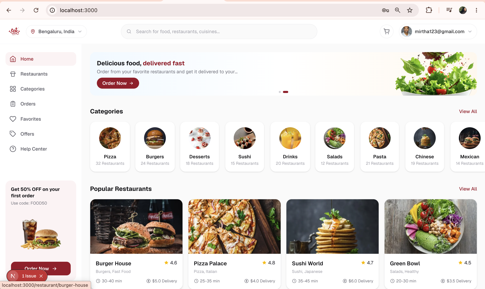

---

## Login

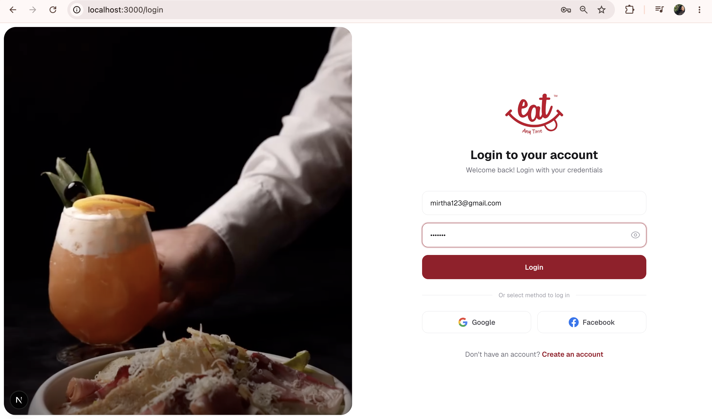

---

## Signup

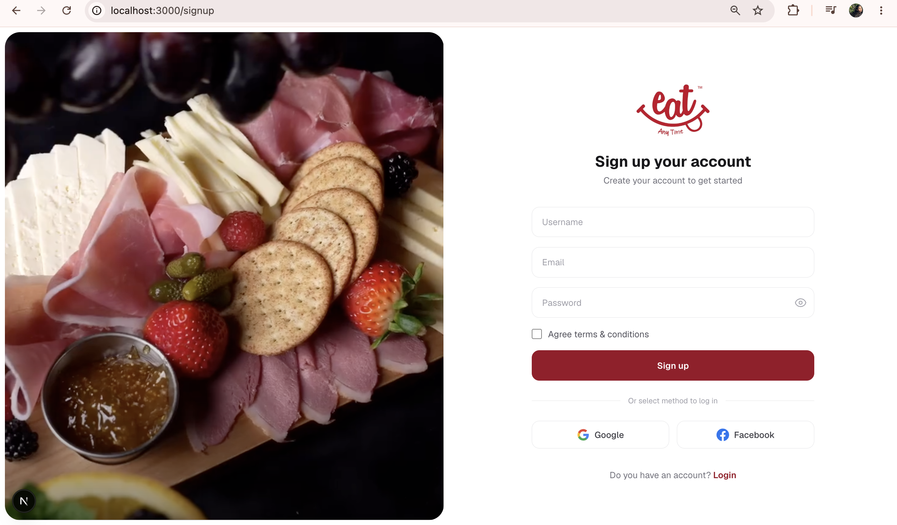

---

## Categories

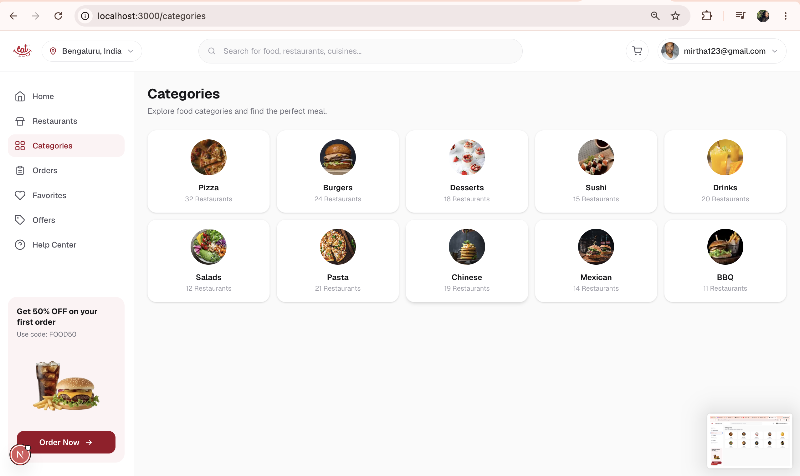

---

## Cart

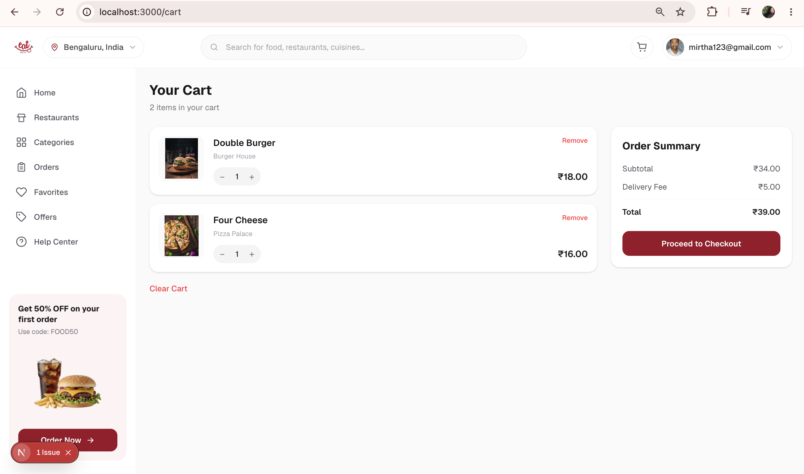

---

## Checkout

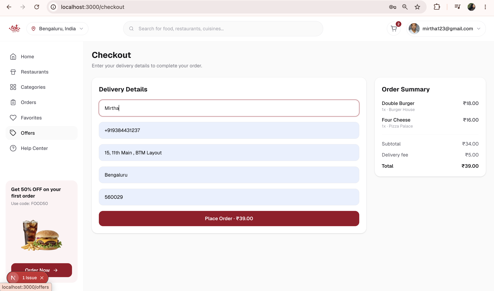

---

## Orders

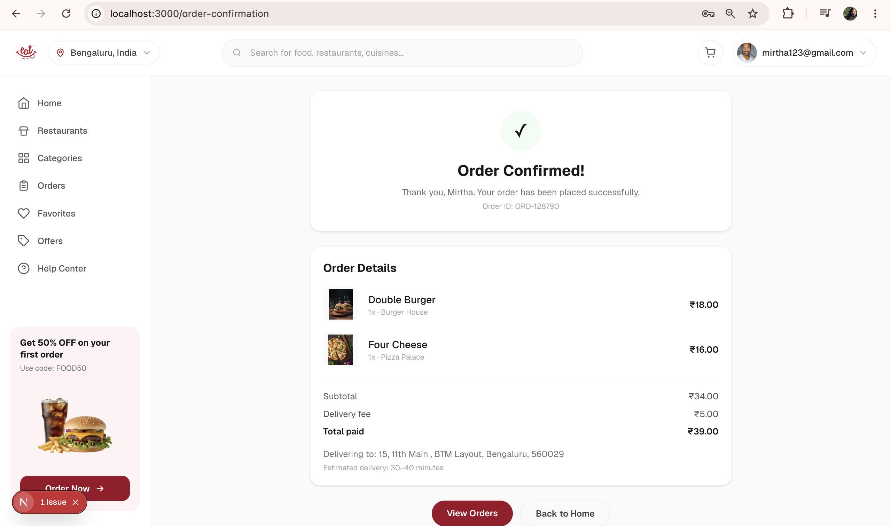

---

## Order History

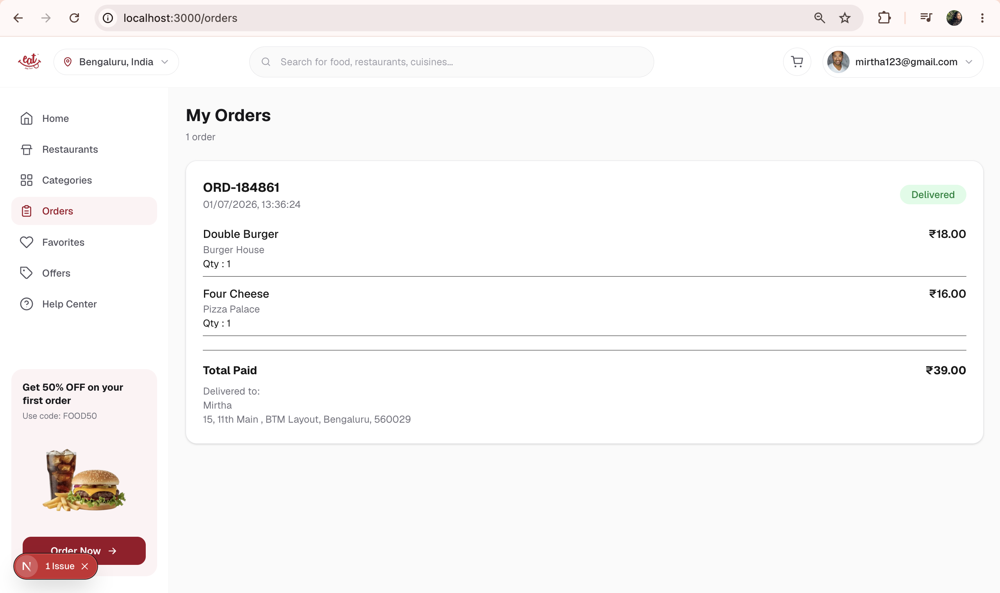

---

## Offers

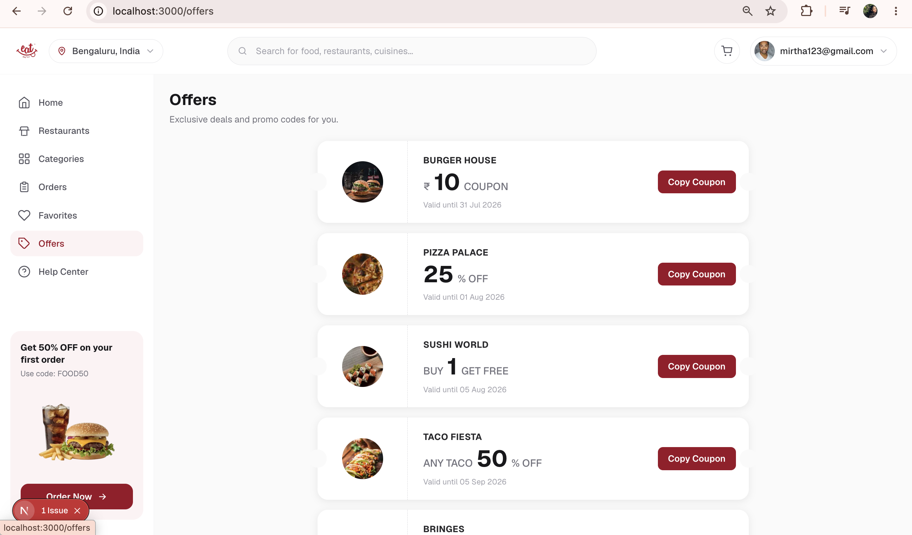

---

## Favourite Restaurants

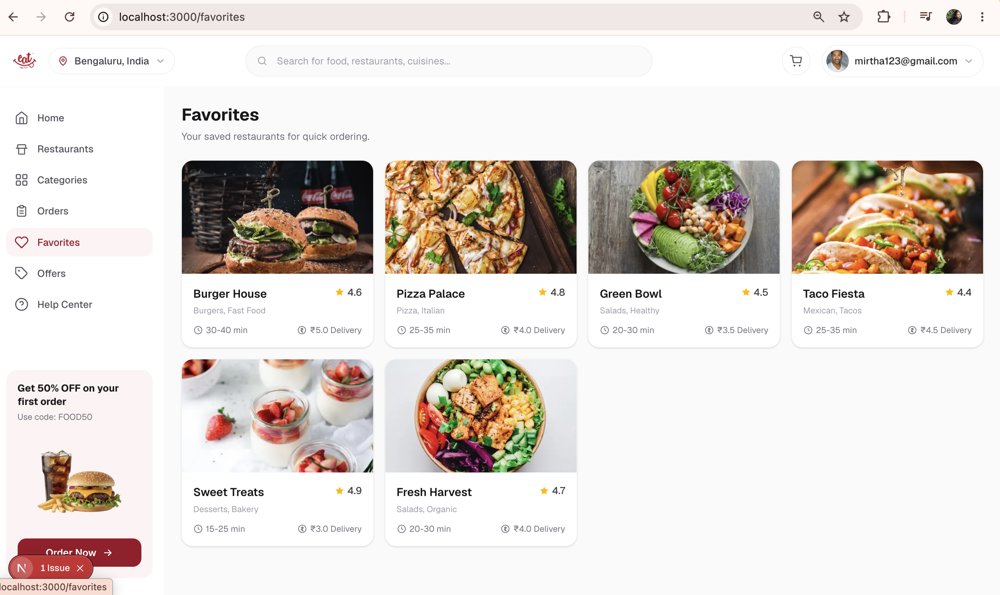

---

## Help Center

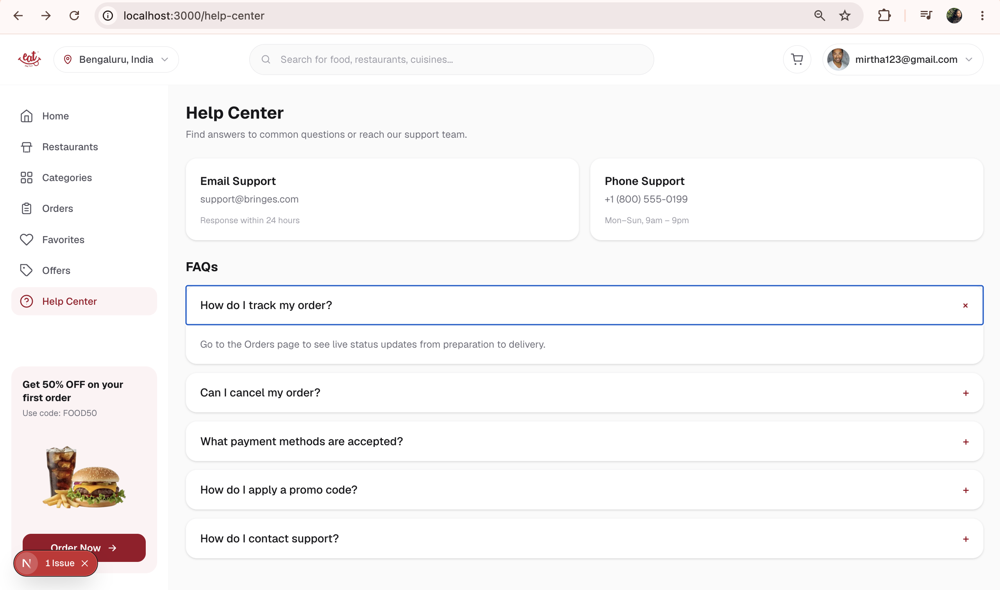

---

## Author

**Shree Harini S**

GitHub:
https://github.com/shreeharini55

---

## License

This project is developed for learning and portfolio purposes.
